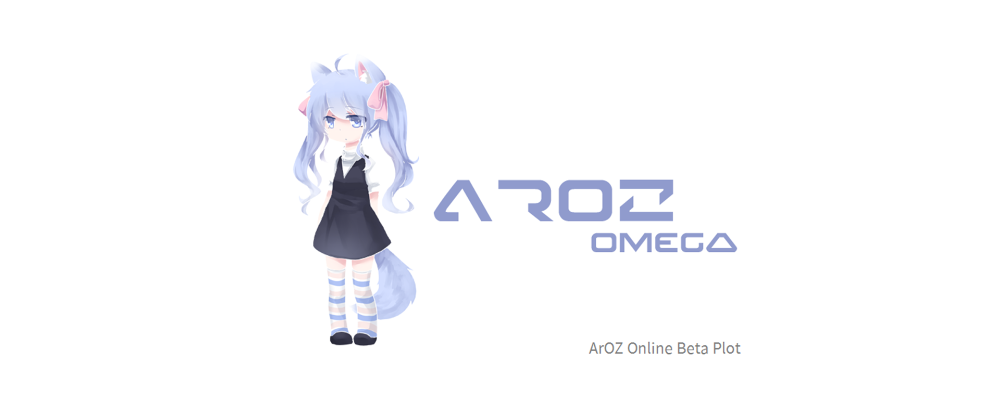
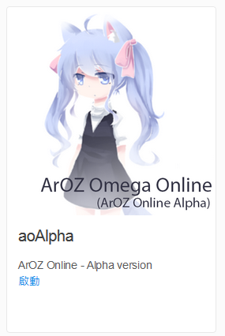
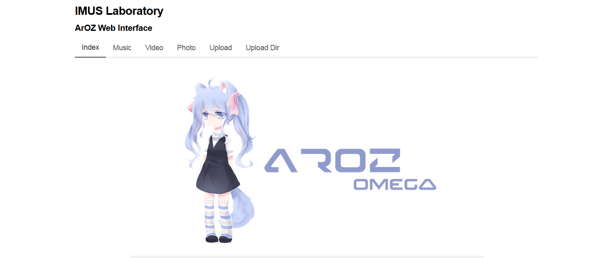
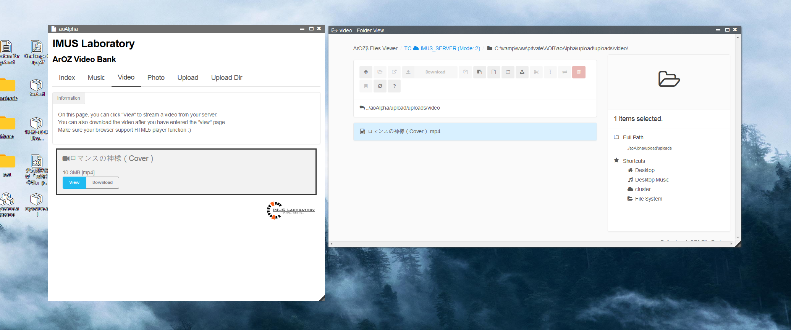

# aoAlpha
The ArOZ Omega Online (aka ArOZ Online Alpha) ported as an ArOZ Online Beta module

## Installation
1. Download the whole repo as zip
2. Unzip everything in module/ into ArOZ Online Root
3. Finished :)

## Screenshots



The rest of the pages are identical to the previous version you can find over [here](https://github.com/tobychui/ArOZ-Omega-Online).

## Migration from original ArOZ Omega Online
This was an old version of ArOZ Online development proposed by tobychui at [here](https://github.com/tobychui/ArOZ-Omega-Online).
ArOZ Online System maintain its backward compatibility to all previous generations and allow cross-usage of modules. 
Hence, if you already have an older version of ArOZ Online System, you can do the following:
1. Copy and paste the whole system into ArOZ Online Root (Usually located at /var/www/html/AOB) and rename the ArOZ Omega Online directory to aoAlpha
2. Download and unzip the new aoAlpha into the same directory, overwriting any file that already exists. 
3. Refresh your browser and see the new ported version appears in your launch menu.

## Compatibility with ArOZ Online Beta File Explorer
To add files into the system without using the old Uploader, you can directly drag drop files into the upload directories under ```aoAlpha/upload/uploads/* ```
Please classify your files by type {music, video or photo}. 
Refresh after the file operation and you will see the files popup in the aoAlpha interface.

## License
MIT License. Please see the LICENSE file for more information.
